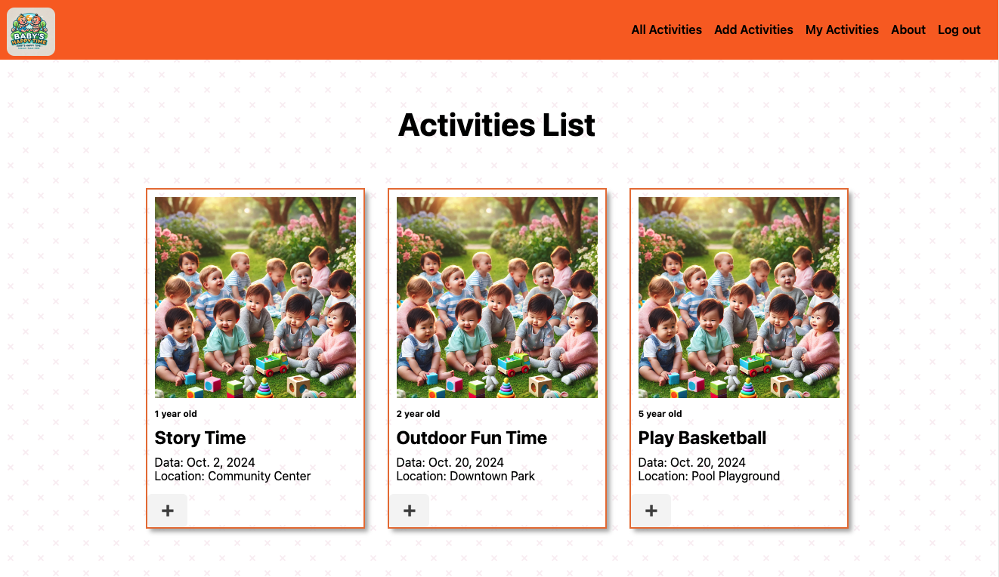

# Baby's Happy Time

 
 
 
  

 

# Welcome to Baby's Happy Time
Baby's Happy Time is a platform designed to help parents and caregivers organize fun activities for babies, toddlers and children. Our goal is to create more opportunities for babies to play together, fostering social development, creativity, and happiness.

# Materials Link
* [Open Baby's Happy Time](https://baby-happy-time-50cc92d73bdd.herokuapp.com)
* [Trello](https://trello.com/b/qCfzd67L/my-trello-board)

# Attributions
* [Chatgpt](https://chatgpt.com/) - Logo, Images

# Next Steps
* Add date and time option to allow activity creator to use that to create activity
* Add photo upload function to allow creator or user to upload pictures
* Add comment and review module to allow user to create reviews or comments